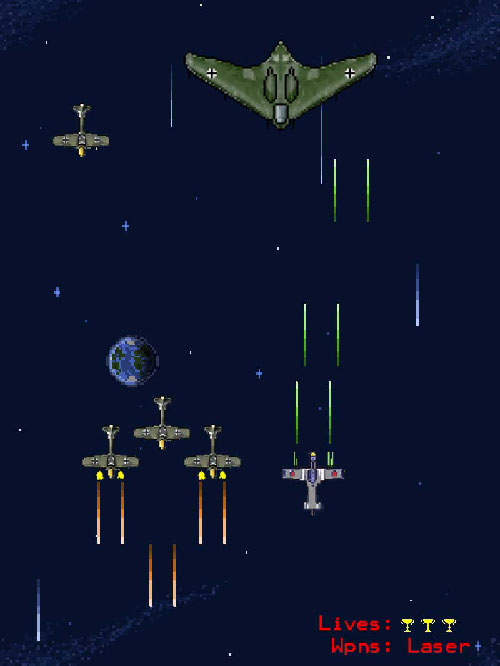

<h1> Iron Skies </h1>
    

<h2> Story </h2>

 At the end of WWII, facing defeat, Germany retreated into space. Fifty years later Germany's back to claim the Fatherland and finish what it started in WWII.

In Iron Skies you play as a pilot of the freedom airforce, a joint task force created to repel the attacking NeoGermans. 

<h2> Screenshot <h2>

 Iron skies utilizes java libraries such as AWT, Javax, and more to display graphics, sounds, and input. 
The engine was designed purely from Java and runs in a browser utilizing the applet library. 

